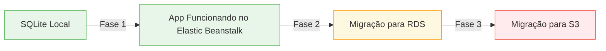

### App Django REST Inicial com SQLite (Base para Migração Futura para RDS e S3)

Este roteiro cria um **projeto Django REST inicial simples com SQLite** que funciona perfeitamente no Elastic Beanstalk (versão 2026), **projetado especificamente para facilitar migrações futuras** para RDS e S3. 

### 📋 Parte 1: Criação do Projeto Local (30 minutos)

#### Passo 1: Estrutura Básica do Projeto

Crie esta estrutura de diretórios (fundamental para detecção automática do Elastic Beanstalk 2026):

```
catalogo-produtos/
├── .ebextensions/
│   ├── django.config
│   └── detection.config
├── .elasticbeanstalk/
│   └── config.yml
├── static/
├── media/
├── requirements.txt
├── Procfile
└── catalogo/
    ├── __init__.py
    ├── settings.py
    ├── urls.py
    ├── wsgi.py
    └── asgi.py
└── produtos/
    ├── __init__.py
    ├── admin.py
    ├── apps.py
    ├── models.py
    ├── serializers.py
    ├── views.py
    └── urls.py
```

#### Passo 2: Configuração Básica (SQLite)

**`catalogo/settings.py`** (partes relevantes):

```python
import os
from pathlib import Path

# Configuração de DEBUG - True para desenvolvimento
DEBUG = True if os.getenv('DJANGO_DEBUG', 'True') == 'True' else False

# Configuração do banco de dados
# SQLite para desenvolvimento, preparado para RDS depois
if DEBUG:
    # SQLite para desenvolvimento local
    DATABASES = {
        'default': {
            'ENGINE': 'django.db.backends.sqlite3',
            'NAME': BASE_DIR / 'db.sqlite3',
        }
    }
else:
    # Configuração preparada para RDS (será ativada depois)
    DATABASES = {
        'default': {
            'ENGINE': 'django.db.backends.postgresql',
            'NAME': os.getenv('RDS_DB_NAME', 'ebdb'),
            'USER': os.getenv('RDS_USERNAME', ''),
            'PASSWORD': os.getenv('RDS_PASSWORD', ''),
            'HOST': os.getenv('RDS_HOSTNAME', ''),
            'PORT': os.getenv('RDS_PORT', '5432'),
        }
    }

# Configuração de arquivos de mídia
# SQLite não suporta S3, mas já preparamos o caminho
if DEBUG:
    # Armazenamento local para desenvolvimento
    MEDIA_URL = '/media/'
    MEDIA_ROOT = os.path.join(BASE_DIR, 'media')
else:
    # Configuração preparada para S3 (será ativada depois)
    USE_S3 = os.getenv('USE_S3', 'False') == 'True'
    if USE_S3:
        # Configurações S3 serão ativadas posteriormente
        pass
    else:
        MEDIA_URL = '/media/'
        MEDIA_ROOT = os.path.join(BASE_DIR, 'media')
```

#### Passo 3: Modelo Simples de Produtos

**`produtos/models.py`**:

```python
from django.db import models

class Produto(models.Model):
    nome = models.CharField(max_length=200)
    descricao = models.TextField()
    preco = models.DecimalField(max_digits=10, decimal_places=2)
    imagem = models.ImageField(upload_to='produtos/', blank=True, null=True)
    data_criacao = models.DateTimeField(auto_now_add=True)

    def __str__(self):
        return self.nome
```

#### Passo 4: API REST Básica

**`produtos/serializers.py`**:
```python
from rest_framework import serializers
from .models import Produto

class ProdutoSerializer(serializers.ModelSerializer):
    class Meta:
        model = Produto
        fields = ['id', 'nome', 'descricao', 'preco', 'imagem', 'data_criacao']
```

**`produtos/views.py`**:

```python
from rest_framework import viewsets
from .models import Produto
from .serializers import ProdutoSerializer

class ProdutoViewSet(viewsets.ModelViewSet):
    queryset = Produto.objects.all()
    serializer_class = ProdutoSerializer
```

**`produtos/urls.py`**:
```python
from django.urls import include, path
from .views import ProdutoViewSet
from rest_framework.routers import DefaultRouter

router = DefaultRouter()
router.register(r'produtos', ProdutoViewSet)

urlpatterns = [
    path('', include(router.urls)),
]
```

**`catalogo/urls.py`**:

```python
from django.contrib import admin
from django.urls import path, include
from django.conf import settings
from django.conf.urls.static import static

urlpatterns = [
    path('admin/', admin.site.urls),
    path('api/', include('produtos.urls')),
]

# Configuração para servir arquivos de mídia em desenvolvimento
if settings.DEBUG:
    urlpatterns += static(settings.MEDIA_URL, document_root=settings.MEDIA_ROOT)
```

### 📦 Parte 2: Preparação para Elastic Beanstalk 2026 (20 minutos)

#### Passo 1: Arquivos Essenciais para Detecção Automática

**`.ebextensions/detection.config`** (CRÍTICO para 2026):

```yaml
# Força a detecção correta como app Python/Django
option_settings:
  aws:elasticbeanstalk:application:environment:
    AWS_EB_PLATFORM_DETECTION: "python"
    AWS_EB_PLATFORM_OVERRIDE: "Python 3.10"
```

**`.ebextensions/django.config`**:

```yaml
option_settings:
  aws:elasticbeanstalk:container:python:
    WSGIPath: catalogo/wsgi.py
  aws:elasticbeanstalk:application:environment:
    DJANGO_SETTINGS_MODULE: catalogo.settings
    DJANGO_DEBUG: True
```

**`Procfile`** (OBRIGATÓRIO para 2026):

```
web: gunicorn catalogo.wsgi:application --bind 0.0.0.0:$PORT
```

**`.elasticbeanstalk/config.yml`**:

```yaml
branch-defaults:
  main:
    environment: null
    group_suffix: null
environment-defaults: {}
deploy:
  artifact: app.zip
global:
  application_name: catalogo-produtos
  default_platform: Python 3.10
  default_region: us-east-1
  include_gitid: yes
  instance_profile: null
  platform_name: null
  platform_version: null
  profile: eb-cli
  sc: git
  workspace_type: Application
```

#### Passo 2: Requisitos do Projeto

**`requirements.txt`**:

```
Django==4.2.11
djangorestframework==3.15.1
gunicorn==21.2.0
psycopg2-binary==2.9.9  # Para futura migração para RDS
boto3==1.28.56          # Para futura migração para S3
django-storages==1.13.3 # Para futura migração para S3
```

### 🧪 Parte 3: Teste Local Antes do Deploy (15 minutos)

#### Passo 1: Configuração Inicial

```bash
# Crie e ative um ambiente virtual
python -m venv venv
source venv/bin/activate  # Linux/Mac
venv\Scripts\activate    # Windows

# Instale dependências
pip install -r requirements.txt

# Crie o banco de dados SQLite
python manage.py migrate

# Crie um superusuário (opcional)
python manage.py createsuperuser
```

#### Passo 2: Teste de Funcionamento

```bash
python manage.py runserver
```

Verifique:
1. Acesse `http://localhost:8000/admin/` (se criou superusuário)
2. Acesse `http://localhost:8000/api/produtos/` - deve ver JSON vazio
3. Teste o upload de uma imagem via POST (use Postman ou curl)

### ☁️ Parte 4: Deploy no Elastic Beanstalk 2026 (20 minutos)

#### Passo 1: Preparar o Pacote para Deploy

1. **Certifique-se de que todos os arquivos estão na raiz** do ZIP
2. **Não inclua**:
   - Diretório `venv/`
   - Arquivo `db.sqlite3`
   - Diretório `.git/`
   - Arquivos `.env`

#### Passo 2: Fluxo Correto para 2026

1. Elastic Beanstalk > **Create Application**
2. Preencha apenas:
   - **Application name**: `catalogo-produtos`
   - **Description**: "Catálogo de produtos para aula"
3. Role até **Application code** > **Upload your code**
4. Clique em **Local file** > **Choose file**
5. Selecione **TODOS** os arquivos do projeto (não a pasta, os arquivos diretamente)
6. Clique em **Zip** para criar um ZIP temporário
7. Clique em **Upload**

#### Passo 3: Aguarde a Detecção Automática

- **Espere 1-2 minutos** enquanto a AWS analisa seu código
- **Não clique em nada** durante este tempo
- Você verá: "Analyzing your code..."
- Quando terminar, aparecerá: **Python 3.10 running on Amazon Linux 2**

#### Passo 4: Finalize e Acompanhe

1. Clique em **Create application**
2. Aguarde 8-10 minutos para o deploy completo
3. Clique em **Environment health** para monitorar
4. Quando estiver verde, clique em **Domain** para acessar seu app

### 🔄 Parte 5: Caminho para Migrações Futuras (Documentação para Você)

#### Migração para RDS (PostgreSQL)

**Quando estiverem prontos, siga estes passos:**

1. **Crie uma instância RDS** no console AWS
2. **Atualize as variáveis de ambiente** no Elastic Beanstalk:
   - `RDS_DB_NAME` = nome do banco
   - `RDS_USERNAME` = usuário
   - `RDS_PASSWORD` = senha
   - `RDS_HOSTNAME` = endpoint do RDS
   - `RDS_PORT` = 5432
3. **Remova o arquivo db.sqlite3** do projeto
4. **Execute migrações**:
   ```bash
   eb ssh  # Conecte-se à instância
   source /var/app/venv/*/bin/activate
   cd /var/app/current
   python manage.py migrate
   ```

### Migração para S3

**Quando estiverem prontos, siga estes passos:**

1. **Crie o bucket S3** conforme discutido anteriormente
2. **Crie o usuário IAM** com grupo correto
3. **Atualize as variáveis de ambiente**:
   - `USE_S3` = True
   - `AWS_ACCESS_KEY_ID` = sua chave
   - `AWS_SECRET_ACCESS_KEY` = sua secret
   - `AWS_STORAGE_BUCKET_NAME` = nome do bucket
   - `AWS_S3_REGION_NAME` = região
4. **Atualize `settings.py`** (descomente a seção S3)
5. **Adicione este código** a `settings.py`:
   ```python
   if not DEBUG and USE_S3:
       # Configurações AWS S3 atualizadas para 2026
       AWS_S3_ADDRESSING_STYLE = "virtual"
       AWS_S3_FILE_OVERWRITE = False
       AWS_DEFAULT_ACL = None
       AWS_QUERYSTRING_AUTH = False
       AWS_S3_SIGNATURE_VERSION = 's3v4'
       
       AWS_S3_CUSTOM_DOMAIN = f'{AWS_STORAGE_BUCKET_NAME}.s3.{AWS_S3_REGION_NAME}.amazonaws.com'
       MEDIA_URL = f'https://{AWS_S3_CUSTOM_DOMAIN}/media/'
       DEFAULT_FILE_STORAGE = 'storages.backends.s3boto3.S3Boto3Storage'
   ```

### 📚 Material de Apoio

### Checklist Visual para Deploy 2026


### Fluxo de Migração Futura

